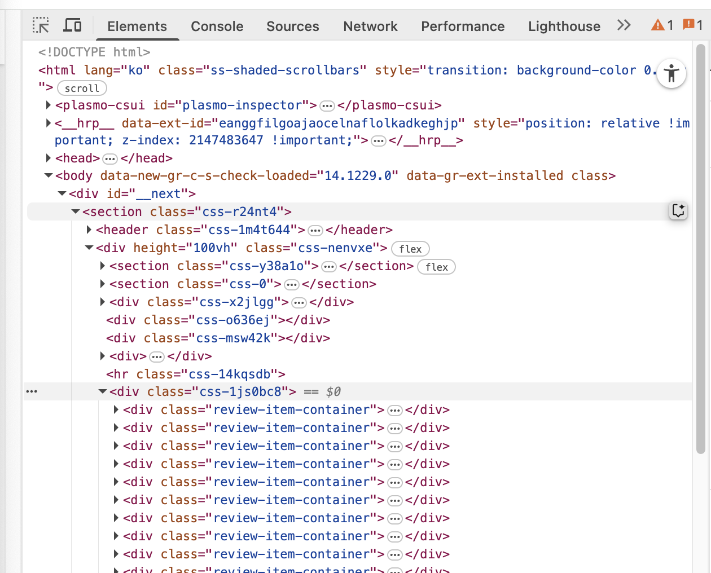

# ai-service-review-summarization

### setup virtual environment

```
# create virtual environment
python3 -m venv .venv

# activate virtual environtment
source .venv/bin/activate

# install requirements
pip install -r requirements.txt

# deactivate virtual environtment
deactivate
```

### set virtual environment

./ai-service-review-summarization/.venv/

### install packages

```
 pip install bs4 selenium
```

### Crawling link

https://www.yanolja.com/reviews/domestic/1000102261?sort=created-at%3Adesc

### considers..

- 스크롤링 하는 로직도 추가

### review container 가져오기


body 안에 해당 경로 찾아서 가져오기.

review_containers = soup.select(
'#\_\_next > section > div > div.css-1js0bc8 > div > div > div')

    review_date = soup.select(
        '#__next > section > div > div.css-1js0bc8 > div > div > div > div.css-1toaz2b > div > div.css-1ivchjf')
